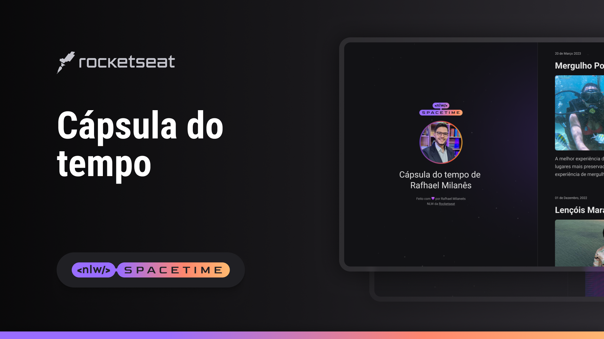

  

## 🖥️ Projeto 
Esse é um projeto web Responsivo de uma cápsula do tempo para exibir memórias em uma linha do tempo.

## 🚀 Tecnologias
Esse projeto foi desenvolvido durante o NWL da Rocketseat com as seguintes tecnologias:

-HTML
-CSS
-Git e Github

## 🏷️ Layout 
Você pode visualizar o Layout do projeto através
[desse link](https://www.figma.com/file/E842NWbEiIzKTJRfdSRMcg/C%C3%A1psula-do-tempo-%E2%80%A2-Trilha-Explorer-(Community)-(Copy)?type=design&node-id=352%3A8&t=f41gU2cGTWhxoRQb-1). 

É necessario ter uma conta no [Figma](https://www.figma.com)
